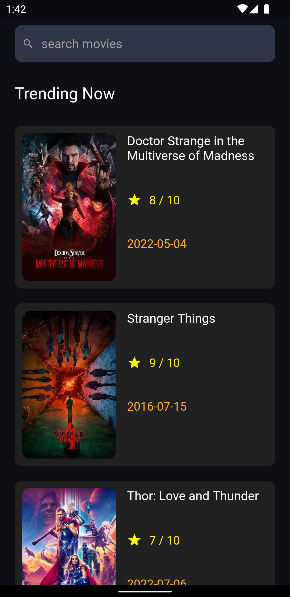
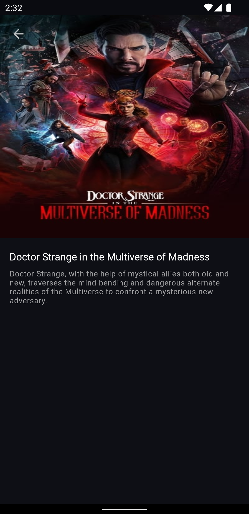
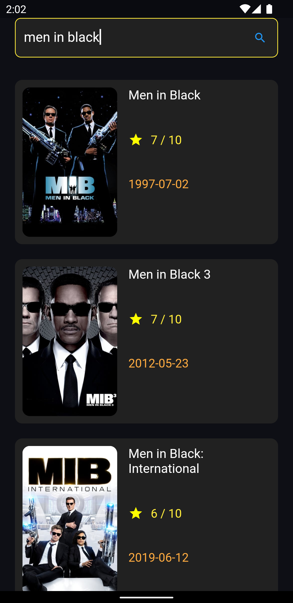

# Trending Movies

A flutter application which shows trending movies of the week using The Movie Database (TMDB) API

    

## Features

- Trending movies of the week
- Search movies
- Get details of a movie like movie overview, release date, rating

## Packages used

- Dio for API client
- Connectivity Plus for listening to internet connection stream
- Flutter Bloc for state management
- Path Provider for persisting state in local storage
- Cached Network Image for caching images
- Shimmer for showing beautiful shimmer effect during fetching of search results

## API Documentation

[https://developers.themoviedb.org/3/getting-started/introduction](https://developers.themoviedb.org/3/getting-started/introduction)

## Future Scope

- Add animations
- Add star cast in the movie details page
- UI enhancements (Add Scrollbar etc ) 
